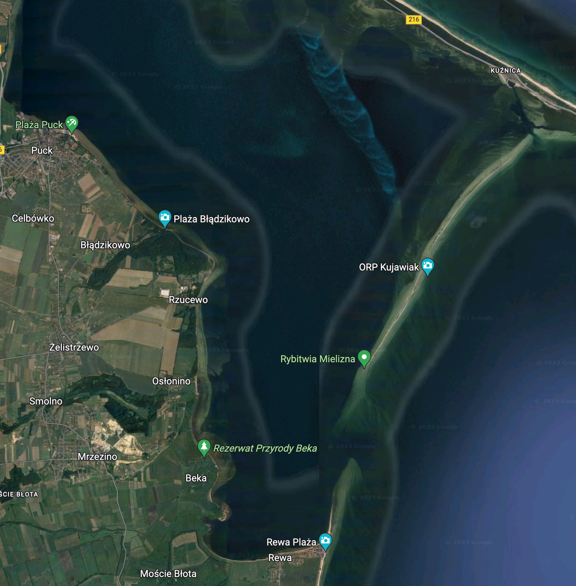
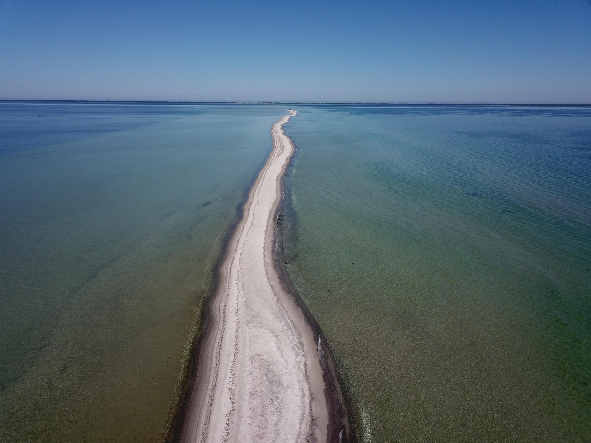

# Marsz dorsza - wycieczka pływacko-pieszo-rowerowa wokół Zatoki Puckiej


Przeżyj przygodę podczas pływania na wodach otwartych, pieszej i rowerowej wycieczki! Zanurz się w orzeźwiających wodach, przemierzaj malownicze szlaki i pedałuj przez zapierające dech w piersiach krajobrazy. Ciesz się wolnością, pięknem i niezapomnianymi wspomnieniami. Przygotuj się na niezwykłą podróż, która odmłodzi Twojego ducha i sprawi, że zapragniesz więcej.

## Trasa wycieczki
* Miejsce startu wycieczki jest w Redzie na peronie PKP.
* Przejazd rowerami do Rewy, dystans 13 km
```geojson
{
  "type": "FeatureCollection",
  "features": [
    {
      "type": "Feature",
      "properties": {
        "stroke": "#ff1800"
      },
      "geometry": {
        "type": "LineString",
        "coordinates": [
            [18.3471768, 54.6053818],[18.34768, 54.60592],[18.34769, 54.60643],[18.3475, 54.60745],[18.3476, 54.6078],[18.34826, 54.60818],[18.34922, 54.60876],[18.35041, 54.60898],[18.35211, 54.60918],[18.35362, 54.60933],[18.3569, 54.60965],[18.35858, 54.60982],[18.35983, 54.60994],[18.36112, 54.61032],[18.36183, 54.61038],[18.36224, 54.61028],[18.36284, 54.61003],[18.36321, 54.60994],[18.3635353, 54.6098382],[18.36513, 54.61011],[18.36907, 54.61053],[18.37586, 54.61126],[18.37892, 54.61157],[18.3832, 54.61202],[18.38638, 54.61236],[18.38937, 54.61266],[18.39054, 54.61282],[18.39163, 54.61268],[18.39618, 54.61134],[18.40067, 54.61],[18.40761, 54.60789],[18.41221, 54.60659],[18.41343, 54.60732],[18.41377, 54.60752],[18.41568, 54.60861],[18.41779, 54.60987],[18.42044, 54.61152],[18.42283, 54.61303],[18.42505, 54.61444],[18.42877, 54.61682],[18.43046, 54.61757],[18.4335, 54.61867],[18.43535, 54.61939],[18.43587, 54.62026],[18.43696, 54.62229],[18.43729, 54.62258],[18.44006, 54.62231],[18.44033, 54.62222],[18.44117, 54.62211],[18.4431, 54.622],[18.44405, 54.62186],[18.44454, 54.62205],[18.44554, 54.62245],[18.44627, 54.6227],[18.45004, 54.62393],[18.45096, 54.62425],[18.45148, 54.62647],[18.45313, 54.62689],[18.4551, 54.62724],[18.45554, 54.62725],[18.45573, 54.62712],[18.45584, 54.62707],[18.45629, 54.62699],[18.45852, 54.62698],[18.45926, 54.62689],[18.45976, 54.62672],[18.46115, 54.62624],[18.46471, 54.625],[18.46586, 54.62459],[18.4678, 54.62391],[18.4692, 54.62343],[18.46963, 54.62338],[18.46998, 54.62347],[18.47137, 54.62391],[18.47344, 54.62458],[18.47588, 54.62536],[18.47703, 54.62573],[18.4784216, 54.6262139],[18.4801, 54.62589],[18.48045, 54.62583],[18.48144, 54.62573],[18.48312, 54.62582],[18.48375, 54.62579],[18.48593, 54.62558],[18.48619, 54.62563],[18.48776, 54.62635],[18.48814, 54.62647],[18.48849, 54.62649],[18.4888299, 54.6264583],[18.48972, 54.62673],[18.49007, 54.62691],[18.49042, 54.62713],[18.49073, 54.62724],[18.49089, 54.62734],[18.49134, 54.62782],[18.49169, 54.62805],[18.49219, 54.62845],[18.49243, 54.62854],[18.49264, 54.62852],[18.49467, 54.62838],[18.49658, 54.62826],[18.49676, 54.62851],[18.4968, 54.62943],[18.49687, 54.63046],[18.49687, 54.63156],[18.49695, 54.63169],[18.49719, 54.6318],[18.49802, 54.632],[18.49848, 54.63205],[18.49938, 54.63207],[18.50147, 54.63214],[18.50522, 54.6324],[18.50686, 54.63255],[18.50783, 54.63263],[18.50816, 54.63263],[18.50916, 54.63251],[18.5091612, 54.632507]
        ]
      }
    }
  ]
}
```
* Zostawiamy rowery w Rewie i taksówką wracamy do Redy
* Jedziemy pociągiem z Redy to Kuźnicy
```geojson
{
  "type": "FeatureCollection",
  "features": [
    {
      "type": "Feature",
      "properties": {
        "stroke": "#ff1800"
      },
      "geometry": {
        "type": "LineString",
        "coordinates": [
            [18.50686, 54.63255],[18.50147, 54.63214],[18.49848, 54.63205],[18.49719, 54.6318],[18.49687, 54.63156],[18.4968, 54.62943],[18.49668, 54.62697],[18.496427, 54.6220905],[18.49626, 54.61869],[18.49603, 54.61446],[18.49604, 54.61275],[18.49587, 54.6115],[18.49572, 54.61088],[18.496253, 54.6082517],[18.49194, 54.60651],[18.48705, 54.60446],[18.48542, 54.60308],[18.4845507, 54.6021969],[18.4816, 54.60357],[18.47212, 54.60472],[18.44767, 54.60476],[18.42403, 54.60515],[18.42006, 54.60451],[18.41736, 54.6029],[18.41071, 54.59636],[18.40479, 54.59038],[18.40042, 54.586],[18.39819, 54.58194],[18.39781, 54.57938],[18.3974658, 54.578759],[18.39759, 54.57852],[18.39667, 54.57837],[18.39255, 54.57802],[18.38693, 54.57748],[18.38674, 54.57753],[18.38456, 54.57734],[18.37794, 54.57679],[18.37495, 54.57809],[18.36854, 54.5818],[18.36543, 54.58365],[18.36338, 54.58501],[18.36115, 54.58795],[18.35965, 54.58953],[18.35791, 54.59075],[18.35668, 54.59193],[18.35534, 54.59404],[18.35367, 54.59665],[18.35144, 54.60016],[18.35032, 54.60168],[18.34825, 54.60461],[18.34758, 54.60543],[18.34768, 54.60655],[18.34769, 54.60788],[18.34929, 54.60883],[18.34887, 54.61064],[18.34797, 54.61322],[18.34725, 54.61462],[18.34665, 54.6152],[18.34532, 54.61598],[18.34173, 54.6195],[18.339, 54.62151],[18.33863, 54.62237],[18.34049, 54.6245],[18.34199, 54.6268],[18.34304, 54.62742],[18.34406, 54.62872],[18.3446, 54.63002],[18.34411, 54.6319],[18.34452, 54.63291],[18.34503, 54.63439],[18.34541, 54.63665],[18.34641, 54.64026],[18.34857, 54.64269],[18.353, 54.64642],[18.35658, 54.64953],[18.36224, 54.65423],[18.36285, 54.65542],[18.36233, 54.65742],[18.36204, 54.6604],[18.36234, 54.66142],[18.36393, 54.66311],[18.36667, 54.66586],[18.37016, 54.66846],[18.37251, 54.67003],[18.37433, 54.67217],[18.3752, 54.67374],[18.37547, 54.67444],[18.37526, 54.67631],[18.37246, 54.68104],[18.37062, 54.684],[18.36889, 54.68695],[18.36892, 54.6882],[18.36965, 54.68908],[18.37499, 54.69337],[18.38143, 54.6986],[18.38815, 54.70415],[18.39041, 54.70597],[18.39352, 54.70875],[18.39382, 54.70897],[18.39392, 54.70902],[18.39396, 54.70911],[18.39392, 54.70918],[18.39403, 54.71058],[18.39313, 54.71396],[18.39235, 54.71712],[18.39202, 54.71941],[18.39281, 54.72159],[18.39301, 54.72239],[18.39293, 54.72604],[18.39322, 54.72994],[18.39371, 54.73281],[18.39385, 54.73491],[18.3924, 54.73743],[18.39126, 54.73898],[18.38926, 54.74107],[18.3883, 54.7433],[18.38671, 54.74763],[18.38544, 54.75112],[18.38532, 54.7517],[18.38549, 54.75212],[18.38563, 54.75222],[18.38574, 54.75227],[18.38578, 54.75234],[18.38576, 54.75242],[18.38566, 54.75259],[18.38576, 54.75301],[18.38689, 54.75383],[18.38973, 54.75516],[18.39531, 54.7576],[18.39645, 54.75856],[18.39698, 54.75996],[18.3975, 54.76133],[18.398, 54.76265],[18.39849, 54.76371],[18.39945, 54.76574],[18.40055, 54.76813],[18.40164, 54.77066],[18.40298, 54.77307],[18.40431, 54.77503],[18.40527, 54.77633],[18.40637, 54.77806],[18.40688, 54.78188],[18.40706, 54.78447],[18.40711, 54.78518],[18.4073, 54.78679],[18.40755, 54.78794],[18.40842, 54.78977],[18.40878, 54.78999],[18.40888, 54.79002],[18.40895, 54.79007],[18.40929, 54.79013],[18.41108, 54.78983],[18.4123, 54.78956],[18.41314, 54.78941],[18.41361, 54.78942],[18.41461, 54.78965],[18.41713, 54.7901],[18.42037, 54.79036],[18.4225, 54.79042],[18.42398, 54.78999],[18.42719, 54.78875],[18.44246, 54.78265],[18.44765, 54.78117],[18.45654, 54.7776],[18.4623, 54.77523],[18.46689, 54.77377],[18.47193, 54.77284],[18.47684, 54.77089],[18.48166, 54.76893],[18.4894, 54.76578],[18.49324, 54.76428],[18.49658, 54.76311],[18.49984, 54.76194],[18.50204, 54.76126],[18.50423, 54.76059],[18.50979, 54.75891],[18.51402, 54.75763],[18.51677, 54.75713],[18.51797, 54.75683],[18.5199, 54.75618],[18.5247, 54.75458],[18.52761, 54.75348],[18.53001, 54.75255],[18.53239, 54.75163],[18.53408, 54.75097],[18.53565, 54.75036],[18.537, 54.74984],[18.53872, 54.74917],[18.54064, 54.74843],[18.54305, 54.7475],[18.54729, 54.74584],[18.55047, 54.74457],[18.55556, 54.74253],[18.55975, 54.74087],[18.56513, 54.73932],[18.57302, 54.7371],[18.57659, 54.73597],[18.58019, 54.73541],[18.58046, 54.73527]
        ]
      }
    }
  ]
}
```
* Z Kuźnicy płyniemy na Rybitwią Mieliznę, dystans około 1 km
* Przemierzamy mieliznę pieszo, dystans około 7 km
* Płyniemy z Rybitwiej Mielizny do Rewy, dystans około 4 km
* Jedziemy rowerami do Władysławowa z przystankami na odpoczynek, dystans 30 km
```geojson
{
  "type": "FeatureCollection",
  "features": [
    {
      "type": "Feature",
      "properties": {
        "stroke": "#ff1800"
      },
      "geometry": {
        "type": "LineString",
        "coordinates": [
            [18.5769194, 54.7357636],[18.57699, 54.73574],[18.57707, 54.7357],[18.57714, 54.73566],[18.57721, 54.73562],[18.57726, 54.73559],[18.57731, 54.73556],[18.57749, 54.73547],[18.57813, 54.73515],[18.57836, 54.73504],[18.57862, 54.73491],[18.57883, 54.73481],[18.57917, 54.73464],[18.57923, 54.73461],[18.579229, 54.7346067],[18.57976, 54.73431],[18.57999, 54.7342],[18.58018, 54.7341],[18.58036, 54.73401],[18.5805, 54.73392],[18.58059, 54.73386],[18.5807, 54.73375],[18.58077, 54.73367],[18.58082, 54.73362],[18.58088, 54.73359],[18.58092, 54.73356],[18.58096, 54.73354],[18.58101, 54.73352],[18.58107, 54.7335],[18.58113, 54.73348],[18.58117, 54.73348],[18.58121, 54.73348],[18.58124, 54.73348],[18.58127, 54.73349],[18.5813, 54.73349],[18.58134, 54.73352],[18.58137, 54.73354],[18.5813679, 54.7335425],[18.58148, 54.73352],[18.58157, 54.7335],[18.58167, 54.73349],[18.58176, 54.73347],[18.58209, 54.73339],[18.58247, 54.73332],[18.5832, 54.73318],[18.58349, 54.73314],[18.58361, 54.73311],[18.58369, 54.7331],[18.58386, 54.73306],[18.58403, 54.73302],[18.58423, 54.73297],[18.58447, 54.73291],[18.58463, 54.73287],[18.58471, 54.73285],[18.58479, 54.73282],[18.58487, 54.73279],[18.58494, 54.73277],[18.585, 54.73273],[18.58511, 54.73267],[18.58523, 54.7326],[18.58532, 54.73254],[18.58543, 54.73247],[18.58552, 54.73241],[18.58559, 54.73237],[18.58577, 54.73229],[18.58598, 54.73219],[18.58627, 54.73205],[18.58669, 54.73184],[18.58685, 54.73177],[18.58691, 54.73174],[18.58698, 54.73172],[18.58705, 54.7317],[18.58716, 54.73167],[18.58728, 54.73165],[18.5872808, 54.7316459],[18.58734, 54.73159],[18.5891, 54.73108],[18.58933, 54.73101],[18.59021, 54.73076],[18.59066, 54.73063],[18.59084, 54.73057],[18.59114, 54.73044],[18.593, 54.72967],[18.59346, 54.72948],[18.59385, 54.72934],[18.59449, 54.72913],[18.59493, 54.72899],[18.59519, 54.72891],[18.5951857, 54.7289113],[18.59501, 54.72873],[18.5950121, 54.7287318],[18.58225822, 54.716490258],[18.582910860, 54.717119837],[18.583563495, 54.717749407],[18.584216131, 54.7183789],[18.584868767, 54.719008516],[18.585521403, 54.719638057],[18.586174038, 54.72026758],[18.58682667, 54.720897108],[18.58747931, 54.72152661],[18.58813194, 54.722156120],[18.588784581, 54.722785611],[18.589437217, 54.723415092],[18.590089853, 54.72404456],[18.590742489, 54.724674026],[18.591395124, 54.725303478],[18.592047760, 54.72593292],[18.59270039, 54.72656235],[18.59335303, 54.72719177],[18.594005667, 54.7278211],[18.594658303, 54.72845059],[18.594810962, 54.728597816], [18.5824369, 54.7166147],[18.58244, 54.71661],[18.57206, 54.71226],[18.56413, 54.70706],[18.55323, 54.69898],[18.551, 54.69459],[18.54541, 54.68743],[18.53843, 54.68088],[18.5351, 54.67789],[18.53293, 54.67578],[18.53024, 54.67339],[18.5273684, 54.6713373], [18.527390956, 54.67132457],[18.52735195, 54.671223388],[18.527075597, 54.67050633],[18.526799237, 54.669789275],[18.526522878, 54.669072200],[18.526246518, 54.668355112],[18.52597015, 54.6676380],[18.525693799, 54.66692089],[18.525417439, 54.666203772],[18.525141080, 54.6654866],[18.524864720, 54.66476948],[18.52458836, 54.664052318],[18.524312001, 54.66333514],[18.52403564, 54.66261795],[18.52375928, 54.66190075],[18.523482922, 54.66118353],[18.52320656, 54.66046630],[18.522930203, 54.65974906],[18.522653843, 54.65903181],[18.522377484, 54.6583145],[18.522101124, 54.65759727],[18.521824765, 54.656879981],[18.521548405, 54.6561626],[18.521272045, 54.65544536],[18.52099568, 54.65472803],[18.520719326, 54.654010692],[18.52044296, 54.653293338],[18.52016660, 54.65257597],[18.519890248, 54.651858592],[18.519613888, 54.65114120],[18.519337528, 54.65042379],[18.519061169, 54.64970637],[18.518784809, 54.64898894],[18.518508, 54.648271506],[18.51823209, 54.64755405],[18.517955731, 54.64683658],[18.517679371, 54.646119102],[18.517403011, 54.64540160],[18.517126652, 54.64468410],[18.516850292, 54.64396658],[18.516573933, 54.64324905],[18.516297573, 54.64253150],[18.516021213, 54.64181395], [18.5160461, 54.6417934],[18.51586, 54.64096],[18.51532, 54.63826],[18.51484, 54.63556],[18.51455, 54.63534],[18.51419, 54.63483],[18.5138979, 54.6347666],[18.5114183, 54.6337288],[18.51225, 54.63317],[18.51239, 54.63307],[18.51265, 54.6323],[18.51133, 54.63217],[18.50936, 54.63247],[18.50783, 54.63263],[18.50522, 54.6324],[18.49938, 54.63207],[18.49802, 54.632],[18.49695, 54.63169],[18.49687, 54.63046],[18.49676, 54.62851],[18.49467, 54.62838],[18.49243, 54.62854],[18.49169, 54.62805],[18.49089, 54.62734],[18.49042, 54.62713],[18.48972, 54.62673],[18.48849, 54.62649],[18.48776, 54.62635],[18.48593, 54.62558],[18.48312, 54.62582],[18.48045, 54.62583],[18.4784216, 54.6262139],[18.47588, 54.62536],[18.47137, 54.62391],[18.46963, 54.62338],[18.4678, 54.62391],[18.46471, 54.625],[18.45976, 54.62672],[18.45852, 54.62698],[18.45584, 54.62707],[18.45554, 54.62725],[18.4558, 54.63006],[18.45615, 54.63385],[18.45645, 54.63474],[18.45505, 54.63615],[18.45612, 54.63786],[18.45858, 54.63994],[18.46057, 54.6474],[18.45984, 54.65133],[18.45617, 54.65543],[18.45688, 54.65601],[18.45774, 54.65665],[18.45824, 54.65705],[18.45865, 54.65759],[18.45882, 54.65815],[18.45902, 54.65873],[18.45927, 54.65908],[18.45973, 54.65937],[18.46023, 54.65984],[18.46079, 54.66082],[18.46115, 54.66163],[18.46135, 54.66252],[18.46167, 54.66311],[18.46195, 54.66365],[18.4618, 54.66417],[18.46109, 54.66433],[18.45949, 54.66438],[18.45881, 54.66459],[18.45823, 54.66474],[18.45708, 54.66477],[18.45613, 54.66505],[18.45563, 54.66662],[18.4558001, 54.6679773],[18.4562511, 54.6680116],[18.45634, 54.66832],[18.45694, 54.66939],[18.45811, 54.67318],[18.45901, 54.6762],[18.45939, 54.6774],[18.45989, 54.67902],[18.46017, 54.68003],[18.46059, 54.68096],[18.46137, 54.68251],[18.46218, 54.68406],[18.46292, 54.68544],[18.46256, 54.68699],[18.46392, 54.68991],[18.46558, 54.68984],[18.46601, 54.68977],[18.46649, 54.68951],[18.46716, 54.6893],[18.46777, 54.68928],[18.46815, 54.68945],[18.46852, 54.68976],[18.46946, 54.69065],[18.47027, 54.69169],[18.47064, 54.69225],[18.47106, 54.69276],[18.47135, 54.69325],[18.47126, 54.69359],[18.47102, 54.69416],[18.47064, 54.69449],[18.47036, 54.69466],[18.46959, 54.69509],[18.46599, 54.69657],[18.46104, 54.69828],[18.45975, 54.69882],[18.45997, 54.69827],[18.45963, 54.69829],[18.45793, 54.69882],[18.45682, 54.69957],[18.45502, 54.69964],[18.45391, 54.70003],[18.45343, 54.70079],[18.4523906, 54.7009075],[18.45246, 54.70126],[18.45205, 54.70143],[18.45148, 54.70171],[18.45105, 54.70188],[18.45041, 54.70224],[18.44976, 54.70271],[18.44902, 54.70278],[18.44818, 54.70279],[18.44738, 54.70287],[18.44702, 54.70296],[18.44697, 54.70306],[18.44674, 54.70315],[18.44649, 54.7033],[18.44611, 54.70346],[18.44589, 54.70351],[18.44585, 54.70358],[18.4461, 54.70394],[18.4459, 54.70413],[18.44548, 54.7045],[18.44518, 54.70475],[18.44491, 54.70492],[18.44451, 54.70507],[18.44424, 54.70531],[18.44371, 54.70563],[18.443, 54.70603],[18.44249, 54.70633],[18.44186, 54.7067],[18.44111, 54.70711],[18.44072, 54.70735],[18.44047, 54.70759],[18.44001, 54.70772],[18.43946, 54.70799],[18.43898, 54.70828],[18.43886, 54.70847],[18.43859, 54.70874],[18.43835, 54.70887],[18.43845, 54.709],[18.43856, 54.70911],[18.43838, 54.70938],[18.438, 54.70957],[18.43753, 54.70972],[18.43715, 54.70994],[18.43676, 54.71009],[18.43648, 54.71037],[18.43602, 54.71071],[18.43559, 54.71106],[18.43507, 54.71151],[18.43449, 54.71198],[18.43418, 54.71232],[18.43377, 54.71263],[18.4334, 54.71287],[18.43299, 54.71323],[18.43272, 54.7136],[18.43176, 54.71435],[18.43021, 54.71531],[18.42956, 54.71518],[18.42708, 54.71605],[18.4266, 54.71713],[18.42662, 54.71731],[18.42564, 54.71763],[18.42496, 54.7181],[18.42409, 54.71855],[18.42184, 54.71971],[18.4190137, 54.7212964],[18.41861, 54.72139],[18.41709, 54.72164],[18.4169639, 54.7217269],[18.41607, 54.72191],[18.41602, 54.72213],[18.41596, 54.72219],[18.41394, 54.72218],[18.41137, 54.72215],[18.41103, 54.72222],[18.41065, 54.72231],[18.41054, 54.72255],[18.41014, 54.72261],[18.40943, 54.72273],[18.40515, 54.72381],[18.40274, 54.72286],[18.40226, 54.72273],[18.40171, 54.72268],[18.40153, 54.72248],[18.4, 54.7225],[18.39972, 54.72203],[18.3981, 54.72194],[18.39788, 54.72166],[18.39502, 54.72685],[18.39383, 54.72737],[18.3931, 54.72873],[18.39348, 54.73195],[18.39392, 54.73463],[18.39321, 54.73613],[18.3922508, 54.7383346],[18.39361, 54.73942],[18.39471, 54.74031],[18.39505, 54.74081],[18.39515, 54.74124],[18.39527, 54.74156],[18.39539, 54.74272],[18.39547, 54.74301],[18.3956, 54.74358],[18.39571, 54.74444],[18.39593, 54.74491],[18.39597, 54.74587],[18.39613, 54.74658],[18.39641, 54.7478],[18.39668, 54.74887],[18.39706, 54.75052],[18.39732, 54.75165],[18.39811, 54.75477],[18.39855, 54.75588],[18.39882, 54.75733],[18.39923, 54.75788],[18.39983, 54.75921],[18.40004, 54.75957],[18.40009, 54.75961],[18.400083, 54.7596664],[18.40047, 54.75994],[18.40058, 54.76042],[18.40085, 54.76077],[18.40192, 54.76083],[18.40329, 54.76062],[18.4043, 54.76072],[18.40514, 54.761],[18.40595, 54.76167],[18.40678, 54.76247],[18.40747, 54.76328],[18.40773, 54.76351],[18.40826, 54.76408],[18.40876, 54.76464],[18.40913, 54.76503],[18.40975, 54.7657],[18.41031, 54.76628],[18.41064, 54.76649],[18.41111, 54.7666],[18.41165, 54.7667],[18.41194, 54.76701],[18.41206, 54.76734],[18.41231, 54.76791],[18.41257, 54.76849],[18.41289, 54.76921],[18.41313, 54.76973],[18.41339, 54.77024],[18.41384, 54.77041],[18.4141, 54.77044],[18.4142, 54.77085],[18.41435, 54.77163],[18.41446, 54.77219],[18.4148, 54.77345],[18.41536, 54.77527],[18.41571, 54.77656],[18.4163, 54.7777],[18.41621, 54.7788],[18.41586, 54.77963],[18.41547, 54.78063],[18.41519, 54.78226],[18.41507, 54.78298],[18.41497, 54.78373],[18.41511, 54.78493],[18.41495, 54.78593],[18.41471, 54.78695],[18.41448, 54.78802],[18.41431, 54.78861],[18.4141, 54.78873],[18.41315, 54.78914],[18.4121784, 54.7895754],[18.41078, 54.78992],[18.40922, 54.79013]
        ]
      }
    }
  ]
}
```




# Cel wycieczki
* poznanie piękna przyrody zatoki puckiej od strony wody
* zdrowe spędzenie czasu wymagającego wysiłku fizycznego
* integracja środowiska miłośników turystyki
* satysfakcja ze sposobu pokonania trasy

# Dla kogo jest przeznaczona wycieczka
Wycieczka jest adresowana do osób sprawnych fizycznie, umiejących pływać, przygotowanych kondycyjnie do przepłynięcia 5 km i gotowych na taki dystans po wodach otwartych Zatoki Gdańskiej. Organizator przeprowadza kwalifikację uczestników pod kątem umiejętności pływania. Po etapie wodnym, uczestnik powinien być przygotowany na przejechanie 30 km na rowerze.

# Charakter wycieczki i założenia
Wycieczka ma charakter turystyczny, natomiast ze względu na dłuższy dystans do przepłynięcia, posiada element wyczynowy. Wszystkie rzeczy wozimy lub nosimy ze sobą.

Poruszamy się tempem spokojnym, jednostajnym i dostosowanym do możliwości fizycznych najsłabszego uczestnika wycieczki. Szacowane tempo w wodzie to 2:30 min / 100 m. Przemieszczamy się w grupie, nie zostawiamy nikogo w tyle. Podczas pływania można zastosować drafting wedle chęci i potrzeb uczestników aby zredukować opór wody.

Wycieczka odbywa się w grupie od 3 do 5 osób.

# Bezpieczeństwo
Przed wycieczką każdy z uczestników powinien zweryfikować swoje umiejętności pływackie pokonując w wodzie dystans 5 km bez odpoczynków. Przykładowym odcinkiem do przepłynięcia jest Zatoka Gdańska od mola w Sopocie do mola w Brzeźnie.

Wycieczka odbywa się latem w słoneczny dzień i gdy prędkość wiatru nie będzie przekraczać 2 m/s. Średnia temperatura wody w Zatoce Gdańskiej w czerwcu wynosi 15 stopni. W dzień wycieczki Organizator weryfikuje prognozę pogody, sprawdzając przewidywane zachmurzenie oraz siłę i kierunek wiatru. Organizator może odwołać wycieczkę w dniu wydarzenia na miejscu startu jeśli okaże się że warunki pogodowe są niesprzyjające. W przypadku odwołania wycieczki, wycieczka odbędzie się w jednym z terminów zastępczych.

Podczas pływania każdy z uczestników płynie w piance pływackiej i jest wyposażony w bojkę asekuracyjną.

Do dyspozycji grupy jest kajak pneumatyczny, którym poruszamy na zmianę wg potrzeb i chęci uczestników.

Na czas pływania zalecane jest użycie płetw.

W sytuacji zagrożenia życia powiadamiamy odpowiednie służby ratunkowe.

# Termin wycieczki
10.06.2023

Zapasowe terminy:

11.06.2023

17.06.2023

18.06.2023

25.06.2023

# Harmonogram wycieczki
* 7:00 Zbiórka w Redzie na peronie PKP. Nie czekamy na spóźnialskich. O 7:00 przyjeżdża SKM od strony Gdyni.
* 7:00 - 8:00 Przejazd rowerami do Rewy, mamy do przejechania 13 km. W Rewie zostawiamy rowery przypięte do stojaków rowerowych. Zabieramy ze sobą w dalszą podróż rzeczy na pływanie. Złożony kajak pneumatyczny niesiemy wspólnie.
* 8:00 - 8:30 Wracamy taksówką do Redy. Przejazd na tej trasie oferuje m.in. firma FreeNow. Czas oczekiwania na taksówkę może wynieść nawet 20 minut, dlatego zamawiamy ją z odpowiednim wyprzedzeniem.
* 8:52 - 9:36 Jedziemy pociągiem REGIO do Kuźnicy. Każdy z uczestników indywidualnie nabywa bilet na pociąg.
* 9:36 - 9:55 Idziemy na plażę w Kuźnicy
* 9:55 - 10:30 Przygotowujemy się do etapu pływackiego. Zakładamy pianki, nadmuchujemy bojki, pompujemy kajak. Rzeczy osobiste pakujemy do zwijanego szczelnego worka, który przymocowujemy do paska bojki asekuracyjnej.
* 10:30 - 11:00 Płyniemy około 1 km na mieliznę. Płyniemy w grupie, wolno i nie ścigamy się by nie zakwasić mięśni.
* 11:00 - 12:30 Idziemy mielizną 6 km. Osoba w kajaku płynie obok lub wspólnie niesiemy kajak. Zmieniamy się w transporcie kajaku według potrzeby.
* 12:30 - 15:00 Płyniemy około 4 km do Rewy. W połowie drogi robimy przerwę na krótki odpoczynek, energetyczną przekąskę i picie.
* 15:00 - 15:30 Zdejmujemy pianki, składamy kajak. Pakujemy nasze rzeczy do sakw rowerowych lub plecaka. Kajak mocujemy do bagażnika rowerowego.
* 15:30 - 16:30 Przerwa na obiad w lokalnej restauracji. Sugerowany dorsz w celu podkreślenia morskiego charakteru wycieczki. :)
* 16:30 - 19:00 Jedziemy rowerami do Władysławowa. Mamy możliwość skrócenia wycieczki wg potrzeb grupy i pojechanie tylko do Pucka. Jedziemy tempem rekreacyjnym i po drodze robimy liczne przerwy na relaks. Z Rewy można również dojechać do najbliższej stacji - Redy.
* 19:10 Wracamy pociągiem z Władysławowa w stronę Gdyni.

# Przygotowanie do wycieczki
* Każdy z uczestników jest przygotowany kondycyjnie do przepłynięcia 5 km w wodach otwartych bez odpoczynku.
* W celu zweryfikowania kondycji fizycznej uczestników, przed wycieczką organizowane jest spotkanie podczas którego płyniemy z mola w Sopocie do mola w Brzeźnie. Uczestnik może również dostarczyć zapisany ślad GPS potwierdzający jego pływackie umiejętności.
* Organizator sprawdza przed wycieczką szczelność kajaku.
* Każdy z uczestników sprawdza szczelność bojki pływackiej i zwijanego worka.
* Każdy z uczestników upewnia się, że wszystkie jego rzeczy osobiste, które bierze ze sobą na czas pływania mieszczą się do worka.
* Polecane śniadanie bogate w węglowodany złożone.
* Organizator sprawdza prognozę pogody w Rewie w serwisie Gurufocus.

# Potrzebny sprzęt i wyposażenie
* rower
* zapięcie do roweru
* sakwy rowerowe lub plecak
* bagażnik rowerowy potrzebny do przewiezienia kajaku (jeden na grupę)
* kajak pneumatyczny (jeden na grupę, waga 12 kg)
* pływanie
  * trykot lub szybkoschnąca koszulka i krótkie spodenki
  * pianka pływacka (nie windsurfingowa)
  * czepek
  * okularki (pasujące, nie przeciekające)
  * buty do wody (takie które chronią nasze stopy podczas chodzenia i w których można swobodnie pływać)
  * płetwy (wg potrzeby)
  * bojka asekuracyjna
  * zwijany worek wodoszczelny
  * saszetka nieprzemakalna
  * siatka na mokre rzeczy po pływaniu
  * energetyczne jedzenie na etap pływacki - zabieramy jedzenie, które znamy i wiemy jak nasz organizm na nie reaguje w trakcie wysiłku
  * telefon
  * pieniądze
  * dowód osobisty

# Reakcje na sytuacje nieplanowane
* Uczestnik spóźni się na zbiórkę. W takiej sytuacji uczestnik nie będzie mógł uczestniczyć w etapie rowerowym i zostawia swój rower w Redzie lub na innej stacji. Następnie czeka na powrót grupy z Rewy i kontynuuje wspólnie z grupą dalszą podróż pociągiem z Redy do Kuźnicy. Po odbyciu etapu pływackiego uczestnik korzysta z komunikacji miejskiej aby dostać się do roweru, po czym wraca do domu.
* Grupa spóźni się na pociąg z Redy do Kuźnicy. Odjazd kolejnego pociągu jest o godz. 9:25, pół godziny później. Cała dalsza wycieczka jest opóźniona o pół godziny względem harmonogramu, natomiast nie jest to problemem. Możemy przyspieszyć etap rowerowy lub wrócić późniejszym pociągiem do domu.
* Pneumatyczny kajak okazuje się nieszczelny. Wówczas próbujemy uszczelnić go łatkami.
* Bojka pływacka uczestnika jest nieszczelna. Jedna osoba płynie kajakiem, więc mamy jedną zapasową.
* Przed rozpoczęciem długiego etapu pływackiego zmieni się pogoda na niekorzystną. W tej sytuacji rezygnujemy z tego etapu i zawracamy do Kuźnicy.
* Uczestnik nie może lub nie chce płynąć z Rybitwiej Mielizny do Rewy. W takie sytuacji może płynąć kajakiem. Może również odłączyć się od grupy i samodzielnie wrócić do Kuźnicy.
* W trakcie długiego etapu pływackiego uczestnik nie może dalej płynąć. W tej sytuacji może zamienić się z osobą płynącą kajakiem lub chwycić się kajaku.
* Podczas etapu pływackiego napotykamy silny prąd zatokowy. Wówczas płyniemy prostopadle do kierunku prądu. Nie siłujemy się z prądem.
* Rowery zostawione w Rewie zostały skradzione. Po etapie pływackim wracamy komunikacją miejską lub taksówką do Gdyni.
* Pociąg z Władysławowa w stronę Gdyni jest przepełniony i nie ma możliwości zabrania naszych rowerów. W tej sytuacji czekamy na następny pociąg (jeżdżą co około pół godziny) z nadzieją że uda się przewieźć rower. Godziny odjazdów późniejszych pociągów z Władysławowa do Gdyni: 19:34, 19:54, 20:26, 21:26, 22:07, 22:54. Możemy też pojechać rowerem do Redy i wsiąść w SKM.

# Telefony alarmowe
* Aplikacja Ratunek (preferowana opcja)
* 601 100 100 - zintegrowany system ratownictwa nad wodą
* 58 675 20 13 - Bosmanat w Jastarni
* 601 411 414 - Kapitanat Portu w Helu

Na trasie wycieczki jest zasięg telefonii komórkowej wraz z dostępem do internetu.

# Koszty
* Udział w wycieczce jest bezpłatny
* Koszty transportu:
  * Dojazd na miejsce startu SKM-ką z Gdańska głównego - 12 zł
  * Wspólny przejazd taksówką z Rewy od Redy - około 30 zł do podziału
  * Pociąg REGIO z Władysławowa do Gdańska Głównego - 17,70 zł
* Obiad w nadmorskiej restauracji / barze

# Atrakcje
* Zatopiony okręt ORP Kujawiak
* Molo w Pucku
* Zamek w Rzucewie
* Osada Łowców Fok w Rzucewie
* Wieża widokowa w Domu Rybaka w Władysławowie

# Ciekawostki i historie o okolicy
* Pod dnem Zatoki Puckiej znajdują się pokłady soli potasowo-magnezowej. W latach 70. XX wieku pojawiały się pomysły odcięcia części Zatoki Puckiej tamą w celu odkrywkowej eksploatacji tych złóż.
* Dawniej mieszkańcy Półwyspu Helskiego chodzili na skróty mielizną na drugi brzeg do kościoła i na targ do Gdyni.
* Głębinka - sztuczny przekop wykonany na początku XX wieku, pomiędzy Rewą a Rybitwią Mielizną, umożliwiający żeglugę pomiędzy Zatoką Pucką a Zatoką Gdańską.
* W trakcie II Wojny Światowej państwo niemieckie ustanowiło poligon wojskowy na terenie mielizny.
* Dawniej tereny Zalewu Puckiego po ustąpieniu zlodowacenia północnopolskiego były lądem. Zalewem morskim stały się około 6 - 5,5 tys. lat temu.

# Prawo
* Organizator nie prowadzi działalności gospodarczej w zakresie organizowania imprez turystycznych i realizuje wycieczki okazjonalnie na zasadach niezarobkowych i wyłącznie ograniczonej grupie uczestników. Wycieczka nie podlega ustawie o imprezach turystycznych i powiązanych usługach turystycznych.
* Rybitwia Mielizna jest objęta ochroną Nadmorskiego Parku Krajobrazowego i Obszaru Natura 2000. Akwen Zatoki Puckiej nie ma ograniczeń w zakresie korzystania z niego przez człowieka.
* Zarządzenie porządkowe nr 5 Dyrektora Urzędu Morskiego w Gdyni wymaga pozwolenia urzędu na żeglugę jednostek pływających (w tym kajak) w obszarze obejmującym część akwenu Rybitwiej Mielizny w okresie migracji ptaków, tj. od 1 lipca do 31 października.

# Regulamin wycieczki
1. Zgłoszenia odbywają się za pomocą formularza https://forms.gle/1DXQ1KMxourTU7hSA
1. Zgłoszenia trwają do 1.06.2023
1. Organizator potwierdza odbycie się wycieczki jeśli zbiorą się minimum 2 osoby.
1. Maksymalna liczba uczestników wynosi 4. Łącznie z organizatorem jest to 5 osób.
1. W przypadku gdy na wycieczkę nie zgłosi się minimalna liczba osób, Organizator informuje o odwołaniu wycieczki.
1. W wycieczce uczestnicy biorą udział na własną odpowiedzialność, niezależnie od warunków pogodowych zastanych na trasach wycieczki i w razie wypadku nie będą dochodzić odszkodowania od Organizatora. Uczestnik na piśmie zrzeka się dochodzenia odszkodowania od Organizatora.
1. W wycieczce mogą brać udział tylko osoby pełnoletnie.
1. Organizator weryfikuje umiejętności pływackie uczestników. Tydzień przed wycieczką Organizator organizuje spotkanie podczas którego wszyscy płyną z mola w Sopocie do mola w Brzeźnie na dystansie 5 km. Uczestnik może również dostarczyć zapisany ślad GPS potwierdzający jego pływackie umiejętności.
1. Wszyscy uczestnicy wycieczki muszą posiadać sprawne rowery, wyposażone zgodnie z przepisami w sprawne hamulce, białe oświetlenie z przodu i czerwone z tyłu, dzwonek.
1. Wszyscy uczestnicy wycieczki muszą posiadać, pompkę rowerową, zestaw naprawczy do kół lub zapasowe dętki, zestaw niezbędnych narzędzi rowerowych.
1. Obowiązuje nakaz przestrzegania przepisów prawa, w szczególności przepisów ruchu drogowego. Za skutki naruszenia tychże przepisów uczestnik odpowiada osobiście.
1. Bagaże muszą być umieszczone na rowerze tak, aby zapewnić bezpieczną jazdę.
1. Organizator nie zapewnia wyżywienia.
1. Uczestnik wycieczki wyraża zgodę na publikację jego wizerunku w relacjach zamieszczanych w mediach społecznościowych oraz materiałach promocyjnych Organizatora.
1. Uczestnik wycieczki wyraża zgodę na przetwarzanie i gromadzenie swoich danych osobowych dla potrzeb uczestnictwa w wycieczce
1. Uczestnicy są zobowiązani do wykonywania poleceń Organizatora.
1. Za szkody wyrządzone przez uczestników wycieczki i za szkody wyrządzone przez osoby trzecie wobec uczestników Organizator nie odpowiada.
1. Organizator nie zapewnia ubezpieczenia. Organizator zaleca wykupienie indywidualnego ubezpieczenia NNW na czas wycieczki.
1. Wycieczka odbędzie się wyłącznie w bezchmurny dzień, a siła wiatru nie będzie przekraczać 2 m/s.
1. W czasie wycieczki obowiązuje całkowity zakaz spożywania alkoholu.
